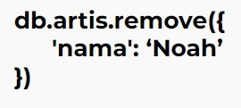

# MongoDB  
MongoDB adalah salah satu database open source NoSQL yang cukup populer digunakan.  
MongoDB sering dipakai untuk aplikasi berbasis Cloud, Big Data maupun Grid COmputing  
MongoDB menggunakan dokumen dengan format JSON  

 

NoSQL adalah Not Only SQL  
Artinya kita bisa mengolah database dengan fleksibel dan tidak membutuhkan Query  

 

**Kelebihan dan Kekurangan MongoDB sebagai salah satu NoSQL**  
Kelebihan :  
* Sistem tidak membutuhkan Tabel  
* Tidak perlu menggunakan Tabel yang terstruktur  
* By Default sudah menggunakan JSON(JavaScript Object Notation), sehingga memudahkan integrasi dengan JavaScript  
* Performa lebih cepat dengan kemampuan menampung banyak data yang bervariasi  

Kekurangan :  
* Tidak mendukung transaksi  
* Masalah konsistensi data  
* Menggunakan banyak memory  
* Hanya bisa menampung maksimal 16MB disetiap document  

 

**Anatomi komponen dari Database MongoDB**  

  

Database adalah wadah untuk menyimpan berbagai macam Collection  
Collection adalah tempat kumpulan dari berbagai macam document, sehingga collection sering disamakan dengan tabel pada SQL  
Document adalah unit terkecil yang berada pada MongoDB  

Contoh data pada MongoDB  

  

 

### MongoDB GUI Tools  
Untuk mempermudah kita bisa menggunakan GUI Tools Official dari MongoDB yaitu MongoDB Compass   

 

### Operasi CRUD MongoDB  
Kita bisa mulai dengan menyalakan MongoDB, lalu kita bisa mengakses dengan mengetikan “mongo” pada terminal  

  

 

Secara default setelah database kita adalah “test”   
Untuk melihat database yang aktif, bisa gunakan db pada MongoDB shell  

  

  

> Untuk melihat daftar database bisa menggunakan show dbs

  

> Untuk Database baru gunakan “use music”

  

> Untuk menambahkan Collection baru kita bisa gunakan db.createCollections(“artis”)  

  

> Untuk menambahkan data pada Collection kita bisa gunakan db.artis.insert({
    nama: "Peterpan",
    genre: "pop"
})

  

> Untuk melihat data kita gunakan db.artis.find()

  

Untuk mengupdate data pada Collection kita bisa gunakan

  

  

Untuk mengupdate data pada Collection kita bisa gunakan  

  

  

 

**Cara untuk mendesain schema MongoDB**  
Schema Design Relational vs MongoDB :  
Jika kita mendesain schema aplikasi MongoDB kita sama dengan mendesain SQL maka kita akan banyak kehilangan fitur MongoDB.  
Karena MongoDB :  
* Tidak ada Formal Process  
* Tidak ada algorithms  
* Tidak ada aturan  

Sebuah MongoDB schema desain yang baik akan memperhatikan :  
* Bagaimana kita menstore data  
* Menghasilkan perfoma Query yang bagus  

 

Dalam mendesain MongoDB kita ada 2 pendekatan yaitu Embedding dan Referencing  

**Embedding**  
Keuntungan : 
* Bisa mendapatkan semua data dalam 1 query  
* Bisa mengupdate semua informasi terkait dalam 1 atomic operation  
* Bisa menggunakan trasaksi operator  

Kekurangan :  
* kita tidak memiliki cara untuk dapat mengaksess embended data sebagai entity yang terpisah secara langsung.  
* Memiliki batasan 16 MB document size  

Dengan Embedding kita memasukan semua data yang terkait dalam satu dokumen.  

Contoh Embedded Document :  

  

 

**Referencing**  
Keuntungan :  
* Bisa mendapatkan semua data dalam 1 query  
* Bisa mengupdate semua informasi terkait dalam 1 atomic operation  
* Bisa menggunakan trasaksi operator  

Kekuarangan :  
* kita tidak memiliki cara untuk dapat mengaksess embended data sebagai entity yang terpisah secara langsung.  
* Memiliki batasan 16 MB document size  

Dengan Referencing kita hanya memasukan data sebagian saja tidak keseluruhan.  

Contoh Embedded Document :  

  

 

### Relasi dalam MongoDB  
**One-to-One Relationships**  
Hubungan one-to-one mewakili dari hubungan 2 objek yang berbeda.   
Jika melanjutkan case study music streaming kita. Maka setiap user hanya akan memiliki detail membership. Detail membership masing masing user tidak akan pernah menjadi milik banyak user dan tidak ada user yang memiliki lebih dari 1 detail membership.  
Cara yang disarankan adalah Embedded  

Contoh One-to-One Relationships :  

  

 

**One-to-Many Relationships**  
Bayangkan kita sedang menggunakan aplikasi music streaming kita, Satu lagu akan diputar oleh banyak user. Lebih detailnya 1 lagu bisa diputar oleh ratusan atau ribuan user.   
Cara yang disarankan adalah Reference  

Contoh One-to-Many Relationships :  

  

**Many-to-Many Relationships**  
Sekarang bayangkan kita sebagai seorang user bisa memiliki playlist, sebuah playlist bisa didengarkan oleh banyak user dan seorang user bisa memiliki lebih dari 1 playlist untuk didengarkan. Lalu dalam playlist kita juga berisi dari banyak lagu.  
Cara yang disarankan adalah Reference  

Contoh Many-to-Many Relationships :  

