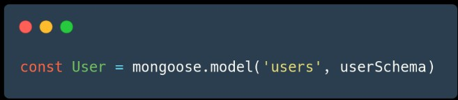
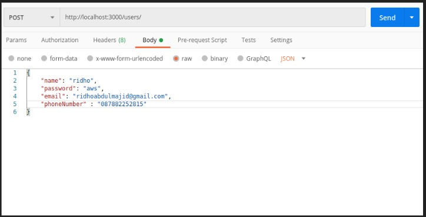

# Mongoose  

### MongoDB  
MongoDB adalah salah satu produk database noSQL Open Source yang menggunakan struktur data JSON untuk menyimpan datanya.  
MongoDB sering dipakai untuk aplikasi berbasis Cloud, Grid Computing, atau Big Data.  

  

> Contoh NoSQL document  

 

### Penggunaan Mongo Shell  

  

 

### MongoDB GUI Tools  
Selain menggunakan Mongo Shell, kita juga bisa menggunakan management tool / admin UI. kita akan menggunakan MongoDB Compass.  

 

### Mongoose  
Mongoose adalah library yang bisa dibilang sebagai Object Modelling MongoDB untuk NodeJS.  
Mongoose bisa digunakan untuk mengelola hubungan antara data, menyediakan validasi.  
Dan juga digunakan untuk menerjemahkan antara objek dalam kode dan representasi Objek tersebut di MongoDB.  

 

### Defining your Schema

  

> Dari potongan kode diatas, kita bisa melihat bahwa kita mendefine Skema, dan tipe data untuk setiap field yang akan digunakan.

  

> Kita juga bisa memberikan validasi data, misal untuk field yang wajib diisi.

  

> Lalu di potongan kode ini, kita menggunakan model users dari schema yang telah kita buat untuk melakukan pengolahan data, atau operasi CRUD.  

 

### Simple CRUD  

  

> Sebelum membuat operasi CRUD, jangan lupa untuk menginstall express untuk routing dan body-parser, untuk menggunakan method Post dan testing API di postman

    

> Untuk menampilkan keseluruhan data (READ) kita bisa menggunakan fungsi find().  

  

 

Kita menggunakan method POST untuk mendaftarkan user, sebelum mendaftarkan kita mengecek dulu apakah user sudah ada atau belum dengan menggunakan findOne(), jika sudah ada akan muncul pesan error, jika belum terdaftar maka user akan didaftarkan menggunakan fungsi create(),
Dan data user bisa diisi menggunakan Postman.

  

> Isi form raw dengan tipe JSON, atau bisa juga menggunakan form-data, untuk mendaftarkan user, setelah itu kita bisa menekan tombol send untuk mengirim request POST.

  

> Dengan kode diatas kita akan mendapatkan data user berdasarkan id, dengan fungsi findById().

  

> Dengan kode diatas kita akan menghapus satu data berdasarkan ID dengan menggunakan deleteOne().

  

> Dengan kode diatas kita akan mengedit/update satu data berdasarkan ID dengan menggunakan findByIdAndUpdate().  

 

### Mongoose Model Methods

  

 

### Mongoose Document Method

  

 

### Populate  
Populate ada kaitannya dengan relasi database. Populate adalah proses penggabungan 2 collection atau lebih menjadi satu objek JSON.  
Kita akan mengupdate schema user kita dan menambahkan address schema untuk mem-populate collection.

  

> Kita menambahkan field address, denga type Schema.types.ObjectId, dan ref merujuk kepada schema “address”.

  

> Kita membuat schema baru, dengan nama address, untuk di populate dengan users schema.

  

> Buatlah Route dengan method POST menuju ke endpoint /address, untuk mengisi alamat, dengan mengisi juga _id user yang ingin kita tambahkan alamat.

  

> Test menggunakan Postman, dengan ID sesuai dengan data user yang ingin ditambahkan di alamat. Lalu tambahkan alamat / address  

  

> Lalu ubah kode untuk menampilkan keseluruhan data user dengan kode diatas. Kita melakukan Populate() dengan address schema, dan akan ditampilkan isi dari address.

  

> Lalu kita test menggunakan Postman untuk method GET ke endpoint /users, data users akan muncul dengan data address, berarti kita berhasil mempopulate schema users dengan address.