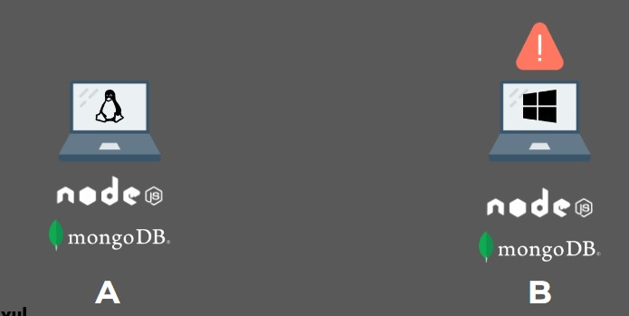
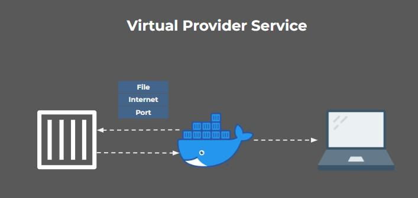
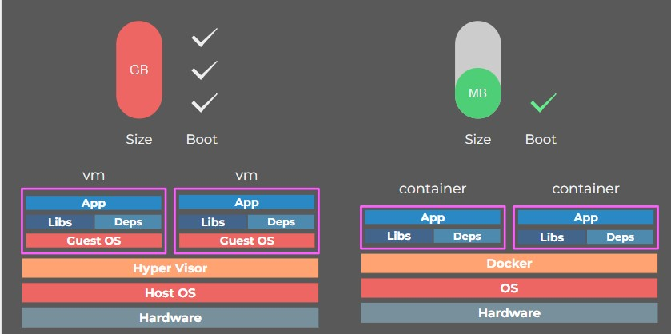
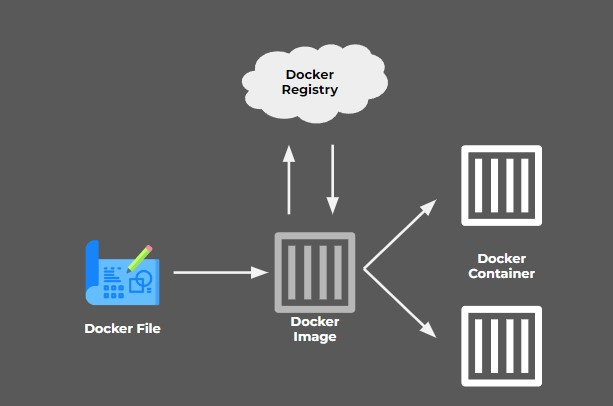
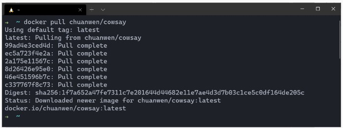
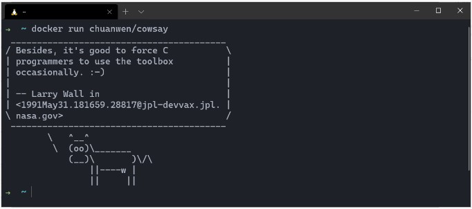
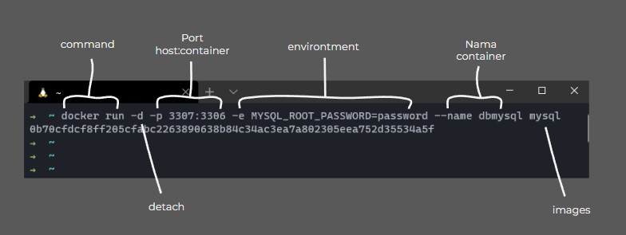
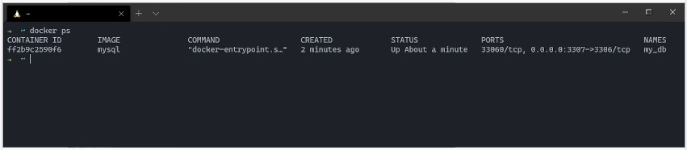
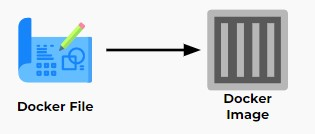

# Docker  

Contoh kasus :  
Komputer B ingin melanjutkan project komputer A, 
Tapi terjadi Issue  

  

"This app doesn’t work on my machine"  
Issue tersebut muncul karena banyak faktor  

 

Untuk hal itu maka kita memerlukan **Docker**  
Docker adalah software yang menjalankan suatu aplikasi menggunakan container  

  

Docker men-sharing kernel dari host OS, serta meng-container-kan suatu aplikasi agar dapat dijalankan dimana saja dan kapan saja.  

Aplikasi yg berjalan di dalam container docker tidak terpengaruh oleh faktor luar karena terisolasi.   

  

Docker berfungsi sebagai penyedia layanan virtual bagi aplikasi yg diinstall pada sebuah host.   
Docker akan menyediakan hal-hal yang diperlukan untuk aplikasi mulai dari akses file, koneksi internet, hingga port agar aplikasi dapat berjalan dengan mulus  

 

**Container vs Virtual Machine**

  

VM memakan banyak resource dan waktu utk booting karena melakukan virtualisasi pada host hardware-nya.   
Sedangkan container kebalikannya dari vm, container melakukan virtualisasi pada host OS-nya.  

 

### Docker Fundamental

  

* Docker File : Blueprint untuk membuat image  
* Image : Template untuk menjalankan container  
* Container : Perwujudan dari image  
* Docker Registry : Tempat untuk upload/download image  

 

### Perintah Dasar di Docker  
**Docker Pull**  
Download image dari docker hub

  

 

**Docker Run**  
Menjalankan container

  

  

 

**Docker PS**  
Melihat container yang berjalan

  

 

**Docker File**  
Merupakan sebuah blueprint untuk  membuat image, kamu juga bisa membuat custom image menggunakan docker file.  

  

Caranya :  
* Buat file Dockerfile di dalam project yang kamu buat  
* Tulis beberapa perintah ke dalam dockerfile  
* Jalankan docker file menggunakan perintah 

