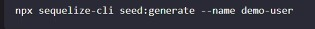

# Sequelize  

  

>templeate express di awal  

 

>di app js

  

>memberitahu bahwa server uda jalan

  

> di dalam index kumpulan dr router  
rooter diambil dr express.router  
Maka slash router akan berubah ke

  

  

>di dalam user.router.js

  

> di dalam controller blmada  
itu semua merupakan started template  

 

  

>tempat sequelize  
dr sequelize menuju database

  

> dr orm perintah lbh singkat  
dengan adanya orm lbh mudah  

  

> perubahan penggunaan sequalize yg lbh mudah  

 

 

> untuk mengsi data dan mencari data 

untuk menggunakan sequalize ada 2 cara :  
* with migration  
* without migration  

Without migration : tinggal ikuti dr step 1

 

>buat dr sini  

Dari getting started  

Migration adalah : History perubahan pada table, jd setiap ada perubahan pada table masuk ke migration  

Contoh perintah ddl masuk ke migration :  
Migration akan menyimpan history perubahan pada table

  

>migration : penympan perubah
seeders : butuh data awal, data demo  

sequalize akan menggunakaan pilih default pada dialect masing-masing  
Kalau butuh setting no port mysql bisa tambah port  
Kalau database gk ada bisa menggunakan db: create

   

perintah2 sequelize

  

>karna database belajar_sequalize blm ada maka menggunakan db:create  

   

Membuat model menggunakan modele:generete

  

> migration melakukan perintah membuat table, ada id, name , pass, dsb

  

>ada up dan down, up buat table, down hapus table

  

> buat ngejalani

  

> sehingga muncu database nya

  

> deskripsi user

  

> sesuai dgn migrasinya  
kalau gk jdi bisa di undo yang dimana dia akan menjalankan down  

  

  

> sehingga user hilang

  

> migration menjalakan sesuai urutan  
kalau memakai undo maka akan mengundo yg paling awal  
kalau undo-all : maka semua akan di down

  

> undo ke migration tertentu  

Membuat table :

    

setelah itu db: migrate

  

> maka colom username jdi ada

  

> membuat kolom di tempat yg diinginkan, menggunakan after  

migrtaion : bisa merubah struktur table

   

Membuat data awal/data demo

  

di file seeders bisa membuat data wal

  

  

> cth membuat data menggunakan seeder, yg akan masuk ke data base

  

> untuk menjalankan 

  

> maka akan ada datanya  

Untuk memasukkan querry  

  

 

> maka berhasil mendapatkan data

  

> memanggil user dr id  

 

Model Blog

  

  

> model blognya

  

>sehingga ada table blog  

Isi data blog

  

  

> di dalam blog

  

> kemudian diisi

  

> data blognya